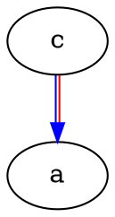
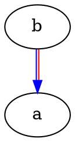

# Override non-leaf packages

This is a repo with an example of two colcon workspaces: an underlay and an overlay.
The underlay contains packages **a** and **b**, where **b** depends on **a**.
The overlay contains packages **a** and **c** where **c** depends on **a**.

Since **a** is non-leaf and overridden, it's changes must be ABI compatible or undefined behavior will occurr in any package that depends on both **b** and **c**.

The packages here are pure CMake packages because I just want to see how colcon warns about them.

## Workspace graphs

This was generated with `colcon graph`.
Arrows point from packages to their dependencies.

### Overlay

### Underlay

